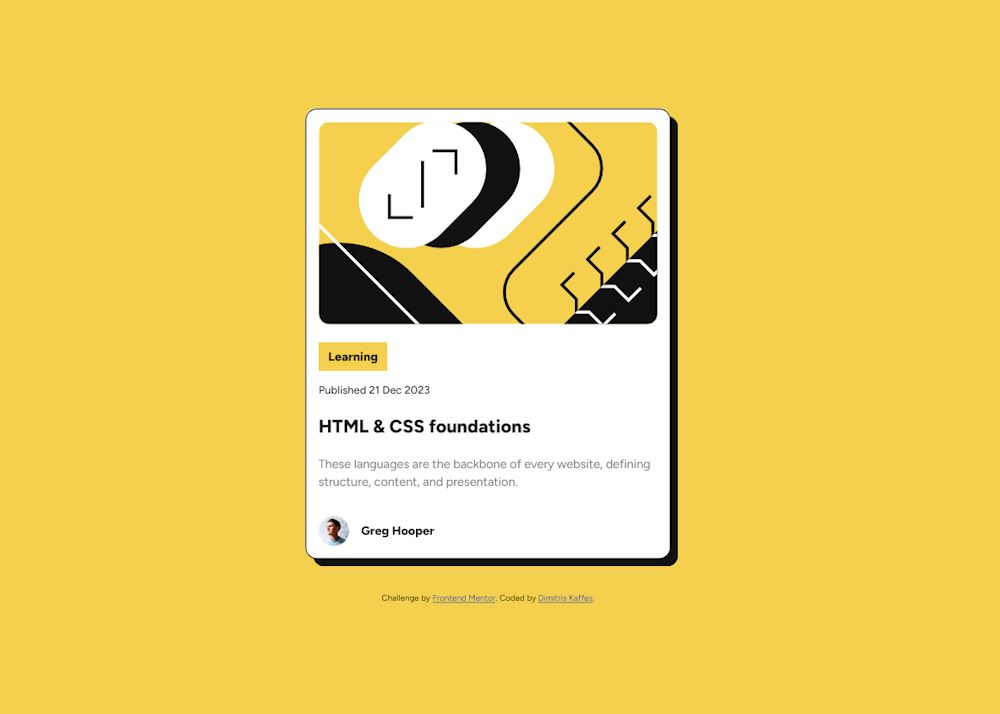

# Frontend Mentor - Blog preview card solution

This is a solution from Dimitris Kaffes to the [Blog preview card challenge on Frontend Mentor](https://www.frontendmentor.io/challenges/blog-preview-card-ckPaj01IcS).

## Table of contents

- [Overview](#overview)
  - [The challenge](#the-challenge)
  - [Screenshot](#screenshot)
  - [Links](#links)
- [My process](#my-process)
  - [Built with](#built-with)
  - [What I learned](#what-i-learned)
  - [Continued development](#continued-development)
  - [Useful resources](#useful-resources)
- [Author](#author)
- [Acknowledgments](#acknowledgments)

## Overview

A simple challenge without the need of a layout change between desktop and mobile view for the blog preview card.

A modern CSS reset (by Andy Bell) was implemented.

### The challenge

Users should be able to:

- See hover and focus states for all interactive elements on the page

### Screenshot

### Links

- Solution URL: [blog-preview-card solution on Github](https://github.com/dkaffes/blog-preview-card)
- Live Site URL: [blog-preview-card live site](https://dkaffes.github.io/blog-preview-card/)

## My process

The HTML was structured using semantic elements.

Custom properties were used for the colors.

A box for the image and another box for the text were used inside the parent card box.

The author icon and name were aligned using Flexbox.

CSS nesting and the `&` nesting selector were used for the `focus`, `hover` and `active` states of the `.text--title-anchor`.

### Built with

- Semantic HTML5 markup
- CSS custom properties
- Flexbox

### What I learned

- A revision of some basic stuff that I have already learned through the previously solved Front End Mentor (FED) challenges.

- How to make the whole card clickable using a pseudo-content trick.

### Continued development

Study in more detail the Andy Bell's: A (more) Modern CSS Reset in more detail.

### Useful resources

- [A (more) Modern CSS Reset](https://piccalil.li/blog/a-more-modern-css-reset/) - This helped me include in my code the proposed (by many FED mentors) CSS reset.
- [How to make the whole card clickable](https://inclusive-components.design/cards/) using the pseudo-content trick described here.

## Author

- Frontend Mentor - [@dkaffes](https://www.frontendmentor.io/profile/dkaffes)

## Acknowledgments

Thanks to the developer [Andy Bell](https://piccalil.li/page/about/) for his CSS Reset.
